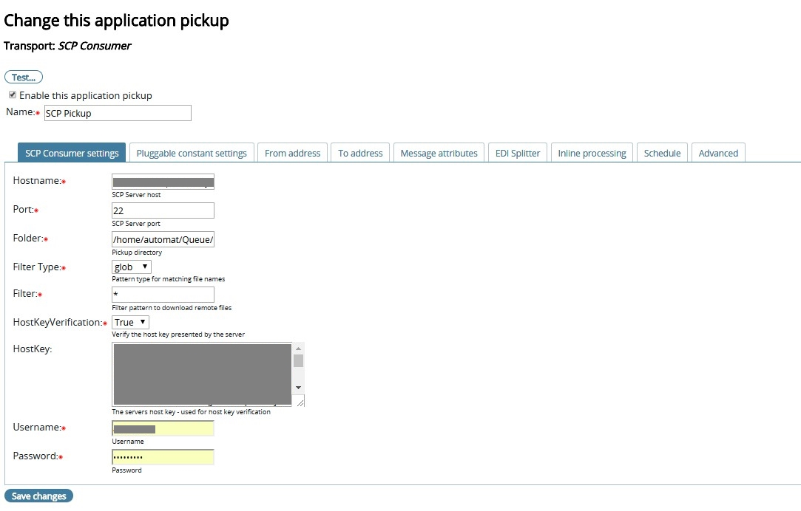
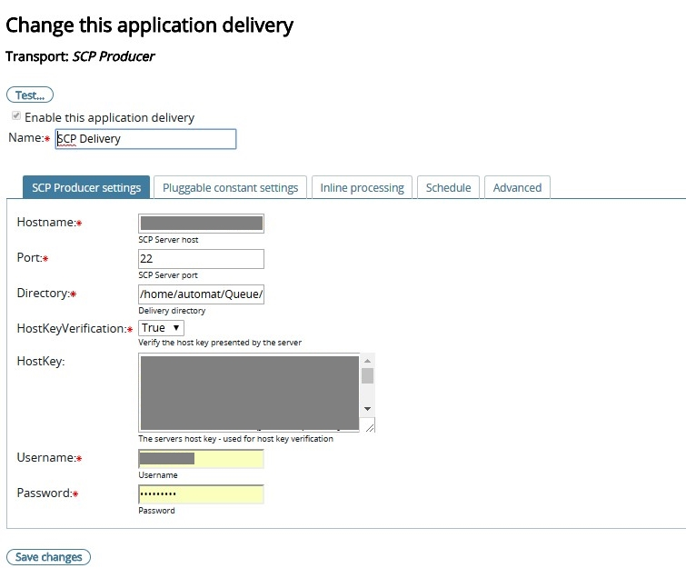

## SCP plugin with Pickup, and Delivery capabilities

* Download PluggableTransport [here](https://github.com/TurnUpTheBass/axway-b2bi-plugins/blob/master/b2bi-scp-plugin/distributions/b2b-scp.zip)
* Extract the contents of the zip file to {B2BI_INSTALL_HOME}/Interchange/site/jars on each of the B2Bi cluster nodes.  All needed referenced libraries are included in the archive. Make sure you keep the sub-folder structure for the referenced libraries.
* This project is depending on a number of 3rd party libraries which have been included in the zip file
* Update the {B2BI_INSTALL_HOME}/Interchange/conf/pluggabletransports.xml configuration file with smb-pluggabletransports.xml
* NOTE: A constant setting with the name 'Exchange type' is used to determine whether the plugin is used for Pickup/Delivery.
* Restart Trading Engine on all the B2Bi nodes
* Source can be viewed [here](https://github.com/TurnUpTheBass/axway-b2bi-plugins/tree/master/b2bi-scp-plugin) 
* If you are building on your local developer environment, add a lib folder to the project and include interchange-server.jar and other relevant dependencies. 
* This connector has been developed for B2Bi 2.3.1 and higher

## Documentation

https://docs.google.com/document/d/1UoMPL7URuyGTJkrjeaKYa9X3jsaGNh7yEdK3CWaHVNA/edit?usp=sharing

### Sample screenshots

#### Sample Application Pickup Configuration

#### Sample Application Delivery Configuration

