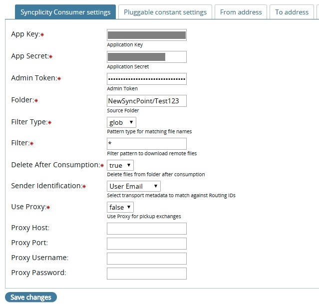
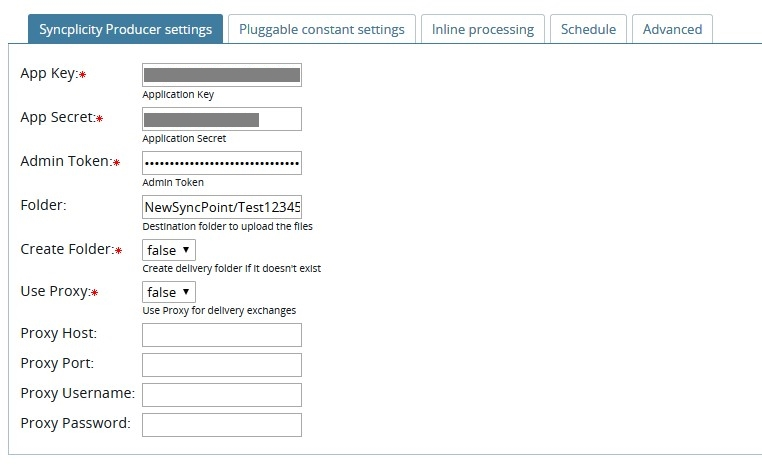

## Syncplicity plugin with Pickup, and Delivery capabilities

* Download PluggableTransport [here](https://github.com/TurnUpTheBass/axway-b2bi-plugins/blob/master/b2bi-syncplicity-plugin/distributions/b2bi_syncplicity.zip)
* Extract the contents of the zip file to {B2BI_INSTALL_HOME}/Interchange/site/jars on each of the B2Bi cluster nodes.
* This project is depending on the following 3rd party libraries: gson (https://github.com/google/gson)
* Update the {B2BI_INSTALL_HOME}/Interchange/conf/pluggabletransports.xml configuration file with azure-pluggabletransports.xml
* NOTE: A constant setting with the name 'Exchange type' is used to determine whether the plugin is used for Pickup/Delivery.
* Restart Trading Engine on all the B2Bi nodes
* Source can be viewed [here](https://github.com/TurnUpTheBass/axway-b2bi-plugins/tree/master/b2bi-syncplicity-plugin) 
* If you are building on your local developer environment, add a lib folder to the project and include interchange-server.jar and other relevant dependencies. 
* This connector has been developed for B2Bi 2.3.1 and higher

## Documentation

https://docs.google.com/document/d/13ZJOqxbR8S8ZP216-ZZ651Pm985H5LlCmknonOgVy7o/edit?usp=sharing

### Sample screenshots

#### Sample Application Pickup Configuration

#### Sample Application Delivery Configuration

